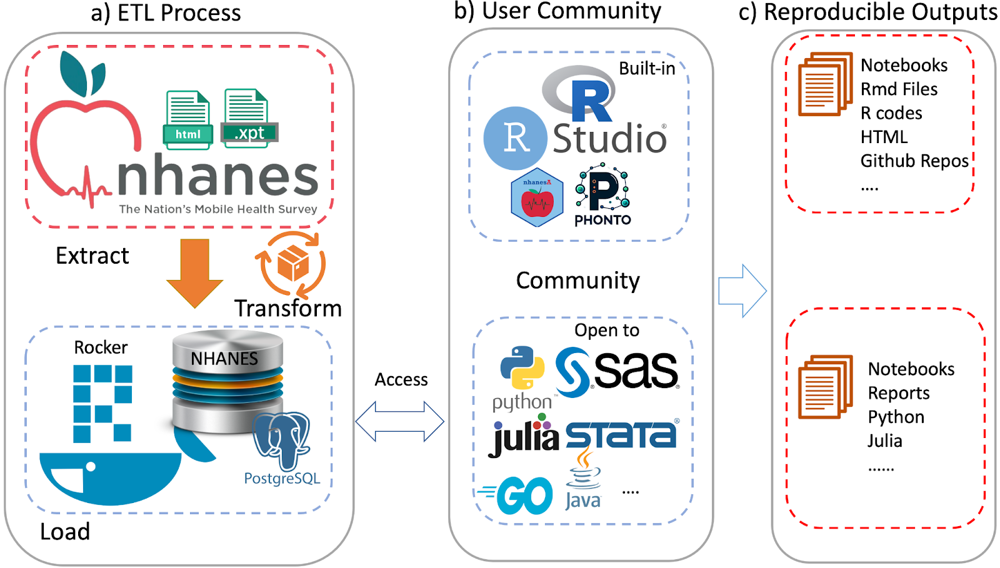

```{r loadlibs, echo=FALSE}
library(phonto)
```

```{r, include=FALSE, eval=FALSE}
##turn this on if you get Latex errors
options(tinytex.verbose = TRUE)
```

# Introduction

Accessible large complex survey data such as that available from the National Health and Nutrition Examination Survey (NHANES) @cdc2023, the UK Biobank @Sudlow2015, or SEER (<https://seer.cancer.gov/>) has had a transformational effect on many aspects of epidemiology and real world data analysis. NHANES is a widely used resource referenced by thousands of papers every year and over 700 GitHub repositories mention NHANES (based on <https://github.com/topics>). Complex datasets such as NHANES often consist of multiple data files with disjoint metadata and documentation resources. Interacting with these and performing analyses typically involves substantial amounts of preprocessing. This can be time consuming and is, in general, error-prone. Use cases often span multiple outcomes (responses) based on complex modeling of tens to thousands of features. In some cases, data are collected over time, or using different methods (e.g. surveys and imaging) so some amount of integration and alignment is needed. Including exposure data based on geography or season will increase the complexity. As a result, the analyses are not easily replicated or extended.

We focus on the NHANES data and describe a system that is based on 1) Docker (www.docker.com), which allows for the detailed specification of the computational tools and resources 2) a relational database, Postgres (https://www.postgresql.org/), that supports SQL and 3) statistical software, R (www.r-project.org) and RStudio (https://posit.co/) which provide tools to support analysis and reproducibility. By releasing a single component, the Docker container, that has appropriate version numbers and can be run on virtually any hardware we simplify access and enable sharing.

The R ecosystem has a long history of fostering reproducibility in scientific computing @RepRes and the production of dynamic documents that can be training material, e.g. package vignettes, but have been extended to support authoring of books @xie2024 and scientific papers where the actual code to create figures and tables is explicitly provided. More recently Dononho @donoho2024 and others have touched on the importance of friction less reproducibility. The system we are proposing would directly support these activities.  And, even more importantly the approach lends itself to a more general concept of low friction extensibility, where a paper and its results can not only be replicated, but they can be extended and enhanced with relative ease. While science relies on reproducibility it progresses through extension and adoption of new methods and paradigms.

# Methods

We describe the tools and methods that we used with explicit references to the NHANES data. This will provide some clarity and readers who may want to implement a similar strategy for different data sources should be able to adjust the process as necessary.

## Creating the Database

The Continuous NHANES is an ongoing survey conducted by the Centers for Disease Control and Prevention (CDC), the national public health agency of the United States. The CDC makes data from the survey available online on its website. Starting from 1999-2000, data was collected in two-year cycles, and made available in the form of a large number of datasets or “tables” for each cycle, until data collection for the 2019-20 cycle was interrupted by the COVID pandemic. The raw data for each table is available as an XPT file in the SAS Transport Format @sas2021xport, along with a corresponding webpage providing detailed documentation about the table. This webpage usually contains a codebook with entries for each variable in the table, as well as general background information on the data collected, often including pointers and suggestions on how to interpret and analyze the data. The codebook consists of a listing of all survey questions in a format that describes the actual data collected. These codebooks detail what data were collected, how it was coded and the target, which can limit who is asked to answer. This information is used to translate the raw data into a form suitable for analysis.

Most NHANES data are publicly available and the terms of use are available on the NHANES website. Some data require special permission to access and have *use constraints*. Our database contains only the publicly available data. However documentation is available for all data and so users can search the documentation for restricted access data, but they will have to apply to the CDC for access.

Specifically, we use manifests from the CDC to identify data and documentation files for downloading. These data are optionally downloaded and preprocessed on a local machine, and saved as a date-stamped snapshot in a GitHub repository (https://github.com/deepayan/nhanes-snapshot). We use functionality provided by the BiocFileCache package to manage the downloading and updating of the actual files, avoiding multiple downloads of the same file. This is achieved via wrapper functions in the `cachehttp` package (https://github.com/ccb-hms/cachehttp). Finally these files are processed via a set of R scripts (https://github.com/deepayan/nhanes-postgres) and / or  Python scripts (https://github.com/ccb-hms/NHANES and https://github.com/rsgoncalves/nhanes-metadata) to create SQL databases, tables, and metadata. This process is largely agnostic to the specific SQL variant used.

To enable users not well-versed in SQL, we also enhance the `nhanesA` package @ale2024 to use the database as an alternative source for NHANES data in a manner that is completely transparent to the end-user. We do this by using the DBI R package as an abstraction layer that can speak to multiple database variants. Individual NHANES data files are mapped to individual tables in the database, and accessing them is thus straightforward. The metadata search functionality, which is more complicated, is implemented via the `dbplyr` package @wickham2023 which implements a dplyr grammar for DBI-compliant databases.

Within the database we create three schemas: **Metadata** tables that contain information abstracted from the NHANES data, codebooks, documentation downloads (explained in more detail in the appendix) and information relevant to the organization of container; **Raw** tables that have a 1-1 correspondence with the data tables provided by the CDC and which have not been altered; and **Translated** tables that have a 1-1 correspondence to the CDC provided tables, but where the categorical variables have been translated to their character values, and in some instances other modifications are made to support appropriate use of the data.

A few public data files are excluded from the database primarily due to their size and the specialized data they contain. Some oral microbiome testing data (collected in two cycles) are omitted because they are in non-standard formats. Four datasets containing imputed Dual Energy X-ray absorptiometry data are omitted as their documentation is in non-standard format. In addition, some files are excluded because they are unusually large; most of these are records of physical activity monitors given to participants of the survey. These datasets can be downloaded from the CDC website and easily integrated into any workflow.

We create open-source software packages in GitHub so that others can access them and ideally provide us with feedback and bug reports. A complete list of the GitHub repositories and their capabilities is given in Supplement Table 1.

## Docker

Docker is a technology that enables the creation of virtual machines that can run on virtually any hardware such as laptops, servers, or in cloud environments. This provides substantial flexibility in where the computation happens and also provides a straightforward means for sharing all the computing infrastructure with others. All they need to do is obtain a copy of the container which could then be run locally. Strictly speaking, Docker is not essential to many of the ideas we propose. Having a Postgres database that runs on a local server would provide most of the benefits. However, for reproducibility we favor the use of Docker containers as it is easier to ensure that all software components are identified. There are established mechanisms for sharing Docker containers as well as functionality for defining and running multi-container applications.

The specific details describing how we constructed the container are given in the GitHub repository <https://github.com/deepayan/nhanes-postgres>. Succinctly, we created a Docker image derived from [rocker/tidyverse](https://hub.docker.com/r/rocker/tidyverse/), which is an Ubuntu GNU/Linux image containing R and RStudio Server, and added a PostgreSQL database containing data from NHANES.

We create and update a set of environment variables, Table 1, that can be tested for so that software can determine whether it is running in this container and hence can use the corresponding tools and database. Version numbers on the container and information on the date the data were downloaded help provide the resources needed to assess reproducibility and accuracy of results. 

We have tried to engineer the system so that any relational database can be used. Another goal of this effort is to allow software packages such as `nhanesA` to be engineered so they function in the same way whether they are used in the container or not. This strategy enables the creation of documents and tools that can function whether or not the container is being used. Since the data are stored in a standard Postgres database users can access the data either directly using SQL from system that they prefer simply by accessing the database directly via the Docker container.


Variable          | Value                    
---------------   | ------------------------ 
CONTAINER_VERSION | Version number for the Container        
COLLECTION_DATE   | Date data were downloaded 
NHANES_TABLE_BASE | Location of HTML documentation, environment variable


## The phonto package

We created an R package named phonto @phonto that contains some specialized code for both processing the data during our ETL process as well as code for supporting merging tables across cycles (`jointQuery`).

There are functions to help identify variables that are not phenotypes, such as `SEQN` which is a unique identifier for each participant, and hence should not be used in any analyses.

## The data and the database

We create a cache of all publicly available data files and all HTML documentation files.  This cache is routinely updated using a strategy that only downloads files that have changed. We then use routines in the nhanesA package to create our extract, transform, load (ETL) process. This creates tables in the database that correspond to the raw (as supplied) and translated (categorical variables are translated from integer values to the appropriate strings) as well as three metadata tables.

We downloaded NHANES data from the CDC website then processed and loaded the data into a PostgreSQL database hosted within a Docker container. We added R functionality to facilitate data manipulation and analysis. These tools not only enhance the efficiency of researchers' work but also make it easier to share their results and improve reproducibility in their analyses.

{#fig:nhanes1}

Figure \ref{fig:nhanes1} illustrates the workflow of our system:
a) ETL Process: The data extraction, transformation, and loading (ETL) process begins with crawling data from the CDC website and transforming it into a structured format suitable for analysis, which is then loaded into a PostgreSQL database within the Docker environment.
b) User Community: The system is designed to be versatile, supporting a wide range of programming languages and statistical tools, including built-in RStudio with custom R packages (nhanesA, PHONTO) to streamline the analysis process.
c) Reproducible Outputs: The system facilitates the creation of reproducible outputs such as notebooks, R Markdown files, and GitHub repositories, enabling researchers to share their work and collaborate more effectively.

A primary advantage of having all data in a relational database is that one can make comparisons both across tables within a cycle or across cycles. These allow the analyst to identify potential problems and inconsistencies in the data.

### Using the Database

The NHANES data were collected using a complex, four-stage sample design, and appropriate analyses of the data typically involve using specialized survey analysis procedures that use weights to account for the sampling scheme. Briefly, each sampled person is assigned a weight reflecting the number of people in the broader population that the individual represents. We recommend using the survey package to perform these analyses. We provide examples of using the weights with the `nhanesA` and `phonto` packages and the CDC provides detailed documentation as well.  

One of the advantages of having the data in one database is that it can easily be queried to perform across cycle analyses. In Figure \@ref(fig:demoplot) we summarize the number of participants by recorded ethnicity and gender by cycle.

```{r getalldemo, error = TRUE, results='hide', echo=FALSE}
##Code from docker-examples.rmd by Deepayan
library(nhanesA)
library(kableExtra)
demo_all <- nhanesSearchTableNames("DEMO")

all_demo_data <- sapply(demo_all, nhanes, simplify = FALSE)
object.size(all_demo_data) # ~45 MB
sapply(all_demo_data, dim)
```

```{r combinedemo, echo=FALSE, results='hide'}
all_demo_data <- head(all_demo_data, -1)
common_vars <- lapply(all_demo_data, names) |> Reduce(f = intersect)
common_vars
demo_combined <-
    lapply(all_demo_data, `[`, common_vars) |>
    do.call(what = rbind) |>
    transform(cycle = substring(SDDSRVYR, 8, 16))
dcm = ifelse(grepl("August", demo_combined$cycle), "2021-2023", demo_combined$cycle)
demo_combined$cycle = dcm
dim(demo_combined)
```

```{r demoplot, fig.width=12, fig.height=7, fig.cap="Ethnicity by Sex and Cycle", echo=FALSE}
library("lattice")
demo_combined |>
    xtabs(~ cycle + RIAGENDR + RIDRETH1, data = _) |>
    array2DF() |>
    dotplot(Value ~ cycle | RIAGENDR,
            groups = RIDRETH1,
            layout = c(1, 2), type = "b",
            par.settings = simpleTheme(pch = 16),
            auto.key = list(columns = 3))
```

When analyzing data for a single cycle we suggest that it is easiest to use the R functions for merging dataframes.  Within a cycle the `SEQN` variable is a unique identifier for each individual and joins across tables are easily carried out.  

![An example of the documentation for a single variable. The values associated with Variable Name, SAS Label and Target are extracted and used as metadata. The table describes the code used in the raw SAS data file, the Value Description column gives the English description of what the code means. Counts indicate how many individuals in that cycle are in each group (row) and the Skip to Item column is used for survey administration. The next question asked can depend on what answer the participant gave.](images/SMQ661.png){#fig:smoking}
```{r smokingEx, echo=FALSE, include=FALSE}
xx = metadata_var("SMQ661")

```

When analyzing data across cycles there can be substantial issues. In Figure \ref{fig:smoking} we show the documentation for one variable, SMQ661.  This variable appears in `r nrow(xx)` cycles: `r paste(xx$TableName, sep=", ")`. When using this variable across cycles it is important to check for consistency in its definition and use.  The function `qc_var` tests for consistency of a single variable across specified set of tables. Currently we test for consistency of the SAS Label, the Target (who will be asked the questions), the description (English Text) and whether or not the variable is used in more than one table within a cycle. There are many other challenges that can occur such as a change in units across cycles, or the set of answers may have changed, just to name a few of the issues.  Analysts will want to know when and where these differences occur.

An example inconsistency involves the `DMDEDUC3` variable from the demography survey, which records education level of children and youth. Notice
that the values (column labels) are inconsistent across cycles. This typographic change will have consequences in modeling if it is not rectified.

```{r changes, echo=FALSE}

mm = metadata_cb(variable = "DMDEDUC3")

mm2 = dplyr::filter(mm, TableName %in% demo_all)

kable( xtabs( ~ TableName + ValueDescription, mm2)[,1:4], caption="Typographic differences across cycles")

```

# Discussion

We believe that by creating a resource of this nature we can help enhance reproducibility and foster the adoption of more sophisticated and appropriate statistical methods. When users are willing to share their code then others will be easily able to replicated and extend their results. We hope to be able to create a sharable resource of analysis documents, ideally in the form of notebooks, which could be coded in different languages. These would be dynamic in the sense described in @RepRes. For example, we have found that use of the survey weights is sporadic, even though accounting for them is essential for most inferences. Having high quality tutorials that are based on the tasks that users need to perform will likely increase the awareness of the need for these methods as well as their adoption.

With any survey of the size and complexity of NHANES inconsistencies are bound to appear.  Some are minor and likely inadvertent and others are responses to external events such as the impact that the global COVID pandemic had on the 2019-2020 cycle.  We believe that there is value in having a resource that can provide a mechanism for discussing and resolving these issues so that users will not need to re-discover them. This can lead to agreed upon best practices for revising and adapting.

Lastly we want to call attention to the ideas of frictionless reproducibility and low friction extensibility (e.g. @donoho2024). Enabling others to very easily replicate and extend research results will help everyone make better use of the NHANES data resource.  Good statistical practice can be enabled using the tools we describe.

## Acknowledgements

The database design based on work done at Harvard Medical school with the Center (now Core) for Computational Biomedicine, (https://github.com/ccb-hms/nhanes-database) and we have benefited greatly from our interactions with them. 

# References

<div id="refs"></div>


# Supplementary Material

The following are useful pages from the CDC NHANES websits

  * https://wwwn.cdc.gov/Nchs/Nhanes/search/DataPage.aspx
  * https://wwwn.cdc.gov/Nchs/Nhanes/search/DataPage.aspx?Component=LimitedAccess
  * https://wwwn.cdc.gov/nchs/nhanes/search/variablelist.aspx?Component=Demographics
  
In Figure S1 we show the documentation from the DEMO table for cycle J.


## The Metadata Schema

Within the database metadata are stored in their own schema. There are three tables that describe the NHANES data:

  * `QuestionnaireDescriptions` - one row per table, all information about the table, use constraints, download errors
  * `QuestionnaireVariables` - one row per variable gives the data from the HTML documentation, translation errors go here, excluded tables go here 
  * `VariableCodebook` - one row for each possible value for each variable; describes the coded values for all categorical variables.
  * `VersionInfo - provides version information and the date the data were downloaded


`QuestionnaireVariables`

This table has one row for each NHANES table/variable combination.  This table captures the information in the variables descriptions, similar to that in Figure S1. Additional information informs on the table name (DEMO_J for the table in Figure S1),  whether there are use constraints.  The IsPhenotype column is one we curate and it indicates whether the variable is a phenotype and could be used as a covariate or a response.  Variables such as individual identifier, SEQN, or the survey weights should not be used as variables in regression models, for example.

```{r QuestionnaireVariables, echo=FALSE}
zz = phonto:::metadata_var()
knitr::kable(colnames((zz)), caption="Variables in the Questionnaire Variables Table",
   col.names="Variables") |> kable_styling(latex_options = "HOLD_position")

```


The `VariableCodeBook` table has one row for each possible value for a variable. So,
for each table, and within that for each variable, there are multiple rows describing the values that variable can have. The column lables of the `VariableCodeBook` table are below.

```{r variablecodebook, echo=FALSE}
zz = phonto:::metadata_cb()
knitr::kable(colnames((zz)), caption="Variables in the Variable Codebook Table",
   col.names="Variables") |>
  kable_styling(latex_options = "HOLD_position")

```

And last we describe the `QuestionnaireDescriptions` table. It has one row for for each questionnaire or table.  The data include the year that the questionnaire was used, the data group (demographics, laboratory etc), whether there are use constraints on the data, the URLs used to obtain the data and the documentation and the release date. The release date can change if the data are modified by the CDC.

```{r QuestionnaireDescriptions, echo=FALSE}
zz = phonto:::metadata_tab()
knitr::kable(colnames((zz)), caption="Variables in the Questionnaire Descriptions Table",
   col.names="Variables") |> kable_styling(latex_options = "HOLD_position")

```
