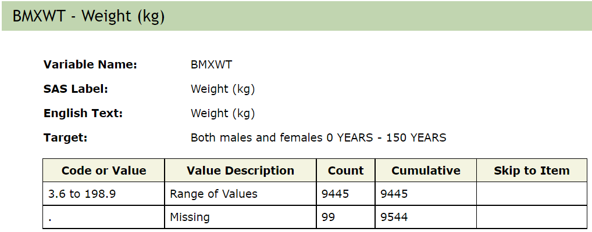
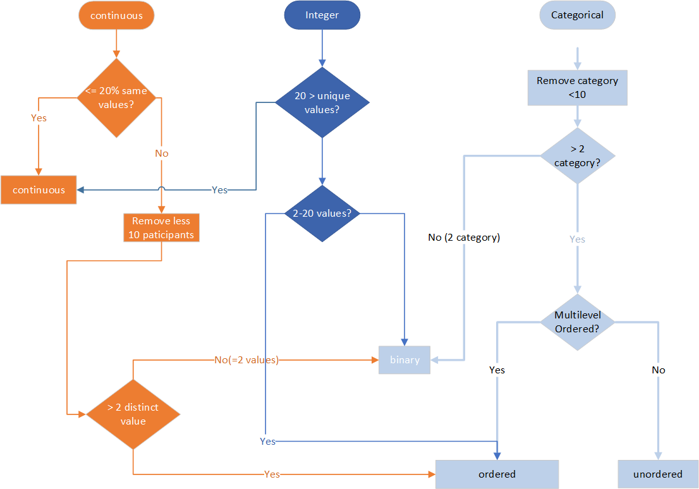

```{r, include = FALSE}
knitr::opts_chunk$set(
  collapse = TRUE,
  comment = "#>"
)
```


### Introduction


 In this vignette we describe the NHANES metadata and give some examples of how it can be used to ensure that the variables and tables used in an analysis are measuring the same things, are reported in the same units, targeted the same demographics and a host of other challenges that might arise.
 We assume that the reader is using either a Docker container with a copy of the NHANES database, or that they have a locally available NHANES database.  These tools can be used with the `nhanesA` package but that will likely be quite slow and cumbersome.
  Details on the NHANES data etc are described in the `Quick Start` vignette and readers should be familiar with that document.
 
## NHANES Metadata

The NHANES metadata is contained in three tables, and at some point in the collection of html documents that the CDC produces for each of the tables.  
The survey is carried out in two year *cycles* starting from the first cycle in 1999-2000. Within each cycle, a set of people are surveyed, however not all of the participants are surveyed across all of the components. Within each of the data categories NHANES has organized the data into Questionnaires and provides web interfaces for descriptions of the contents of each questionnaire.  We do not replicate the web interface as users can browse that information using standard tools, but we have constructed an integrated SQL database representation of much of the publicly available NHANES data.  Placing all of the data into a single database facilitates searching and extraction of relevant values, and this provides many advantages to the individual researcher, as well as to the research world at large.

Each NHANES participant is assigned a unique ID that is stored in the database as <tt>SEQN</tt>. This is used as the primary key and merging of data extracted from different tables should be based on this variable (<tt>SEQN</tt>). 

For each two-year cycle, NHANES provides a set of data, documentation and code books, organized by each of the five publicly available categories mentioned above.  Users can explore the available data at a high level by searching within cycle, category, and measure. One example is the [Body Measures](https://wwwn.cdc.gov/nchs/nhanes/2001-2002/BMX_B.htm) table which provides data from the 2001-2002 examination data. The web page provides details on the measurements and how they are recorded.
A screen shot of that page is given below.  These pages typically have a brief description, that outlines how the data were collected and gives suggestions on how they should be analyzed and interpreted. Limitations and changes from previous years are also given.  Analysts are strongly encouraged to read these prior to do any work.  On the right side there is a list of the variables that were collected. They are in the form of a short all-capitals label (typically the *SAS Label*) followed by a more descriptive title.

{width=90%}

Below are examples of two of the variables, the first SEQN, is the sequence number, which provides a unique identifier for each individual within a cycle.  SEQN can be used to join data across tables within cycles. SEQN are not reused and there are no examples of individuals participating in more than one cycle.

{width=80%}

{width=80%}

### Metadata Tables

Within the NHANES database we have constructed 2 metadata tables to provide easy access to the details that are reported in the HTML pages described above.  There is an additional metadata table that describes where each table was downloaded from, what cycle it belongs to, the year and data group as well as when the data were published.  NHANES regularly provides updates which will have the same name as the original table but a new publication date.


 **QuestionnaireDescriptions**
 
 One row for each table. Describes each table with contents, what year it was collected, what type of data, URLs for the data and documentation files, the date the table data were published:
 
 - TableName
 - Description
 - BeginYear
 - EndYear
 - DataGroup
 - UseConstraints
 - DocFile
 - DataFile
 - DatePublished

**QuestionnaireVariables**

 One row for each variable within tables.  Provides a summary of the header information for that variable.
 The label used for it, the instructions that were given to the respondent, whether something is a phenotype (as distinct from say survey weights or other variables that are not themselves intended to be analyzed). UseConstraints seem redundant here - I assume that they are regulated at the table level, not the variable level.
 
 - Variable
 - TableName
 - SasLabel
 - Description
 - EnglishInstructions
 - Target
 - UseConstraints
 - IsPhenotype
 - OntologyMapped

**VariableCodebook**

One row for each variable within tables. Provides the detailed information on what values were obtained, the meanings for any non-numeric values, and in some cases how to interpret special numeric values (say 0 for missing or negative values to indicate some characteristic of the respondent).

 - Variable
 - TableName
 - CodeOrValue
 - ValueDescription
 - Count
 - Cumulative
 - SkipToItem


```{r describeTables}

## Need to combine data from BPQ*, BPX*, and DEMO*
bpq_tables <- c("BPQ", "BPQ_B", "BPQ_C", "BPQ_D", "BPQ_E", "BPQ_F", "BPQ_G", "BPQ_H", "BPQ_I", "BPQ_J")
bpx_tables <- c("BPX", "BPX_B", "BPX_C", "BPX_D", "BPX_E", "BPX_F", "BPX_G", "BPX_H", "BPX_I", "BPX_J")
demo_tables <- c("DEMO", "DEMO_B", "DEMO_C", "DEMO_D", "DEMO_E", "DEMO_F", "DEMO_G", "DEMO_H", "DEMO_I", "DEMO_J")

bpxVars = c("BPXSY1", "BPXSY2", "BPXDI1", "BPXDI2")

demoVars = c("RIDRETH1", "RIDAGEYR",  "RIAGENDR", "DMDEDUC2")
bpqVars = c("BPQ020", "BPQ050")
```

```{r querymetadata}
QuestionnaireDescriptions <- dplyr::tbl(phonto:::cn(), I(nhanesA:::MetadataTable("QuestionnaireDescriptions")))

QuestionnaireVariables <- dplyr::tbl(phonto:::cn(), I(nhanesA:::MetadataTable("QuestionnaireVariables")))

VariableCodeBook <- dplyr::tbl(phonto:::cn(), I(nhanesA:::MetadataTable("VariableCodebook")))

demoAtarget = dplyr::filter(QuestionnaireVariables, (TableName %in% demo_tables) & (Variable=="RIDAGEYR") )
dAt = dplyr::collect(demoAtarget)
ans1  = dplyr::pull(demoAtarget, "Target")

DemoAgeCodebooks = dplyr::filter(VariableCodeBook, (TableName %in% demo_tables) & (Variable=="RIDAGEYR"))
AgeCb = dplyr::collect(DemoAgeCodebooks)

sp1 = split(AgeCb, AgeCb$TableName)

library(stringr)
ptabs = dplyr::filter(QuestionnaireDescriptions, str_detect(TableName, "^P_") )
```


### 1. Quick check NHANES data

We can efficiently access NHANES data using `phonto` and `nhanesA` together. By simply knowing the name of the data file or table, one can very quickly and efficiently obtain basic information, e.g. column names, dimensions, etc. 

First we load up the packages we will use for this vignette.
```{r setup}
library(nhanesA)
library(phonto)
library(DT)
```

Let's take a body measure table as an example, (<tt>BMX_I</tt>).

- show column names of an NHANES table. 

```{r}
nhanesColnames("BMX_I")
```

- show number of rows/columns and dimension of an NHANES table
```{r}
nhanesNrow("BMX_I")
nhanesNcol("BMX_I")
nhanesDim("BMX_I")
```

- First/Last records of an NHANES table

```{r}
nhanesHead("BMX_I")
nhanesTail("BMX_I")
```


### 3 nhanesCodebook

Information about each variable is stored in the NHANES code book. To access the NHANES code book one can use the `nhanesCodebook` function. The function returns a list of length 5 that provides pertinent information about the variable. The first four elements provide basic descriptor information, i.e. `Variable` is the variable name, `Description` is the actual text of the question (or a description of the lab value), `Target` tells you which participants were eligible to be asked and `SasLabel` is the variable label.
The 5th element, the `Codebook`, is a data frame providing information about the structure of the variable, such as which values the variable can take on. When you want to combine variables across study years you will need to be careful to ensure that the `Codebooks` are compatible.  NHANES has changed variables, added or removed possible answers, and done many other things as the questionnaires have evolved.  It is **not safe** to assume that an identical variable name will have an identical interpretation.
 
```{r}
 LDLTabs = nhanesSearchVarName('LBDLDL')
 LDLTabs

  cb1 = nhanesCodebook(nh_table = LDLTabs[1], colname = "LBDLDL") 
  cb1
```

  The alert reader will have noticed the column labeled Cumulative.  The values in this column are provided by NHANES and can be used to check whether the data extraction you carried out aligns with their reported values.  The column labeled SkipToItem will be non-missing if there was some complex logic in how the survey was performed. In some cases a set of questions will be skipped for a subset of the participants, depending on their answer to the *current* question.  For example, if the current question was ``Have you ever been told by your doctor you have Diabetes?``, and then there say 10 follow-up questions asking about symptoms, someone who answered ``No`` would not want to answer those questions, and so the interviewer will skip over them, to the next relevant question for anyone who says ``No``. This makes for a good survey experience for the participants but it also makes the data analysis a bit messier.  The analyst will have to examine all the questions that can be skipped and assess how to deal with the values recorded.
  While we are on the subject of messy data, the `Target` information can also introduce structured missingness into your data. Some questions are only relevant to certain age groups, and in those cases the `Target` field will indicate who is going to be asked. Everyone outside of the `Target` range will have a missing value for that question.

## Data Consistency

Because NHANES is a multi-year (multi-cycle) survey it will be important to examine data consistency across cycles.   Most TableNames use the naming convention of basename with a suffix that can be missing or
that uses underscore followed by a capital letter in the range [B..J], ie 'TableName_X'.  In 2020 data collection was halted and data collection for the 2019-2020 cycle was incomplete.  The CDC has combined the collected data for the 2019-2020 cycle and labeled these tables using similiar prefix convention of 'P_TableName', was used. [We don't currently have these in the PostgresDB].

We treat the combination of TableName and VariableName as uniquely identifying a feature or phenotype. For example, we anticipate that user might like to analyze all systolic blood pressure measurements in the 'BPX' set of tables (eg `BPX, BPX_B, ...,BPX_J`) in a single analysis.  But in order to do this they need to verify that essentially the same phenotype was measured in each cycle.  Checking for consistency can be done using the metadata.  We will also suggest that there are two consistency issues that may need to be addressed. One is whether the phenotype is consistently measured and a second is whether or not there is drift in targeting or other aspects of the data collection process.

### Phenotype Consistency

Here we are mainly focused on looking at the CodeBooks and trying to assess whether the information in them has been collected consistently across different cycles.  For this purpose the `qc_var` function can be quite helpful.  We use the LDL example from above, where the LBDLDL variable reports LDL cholesterol levels in mg/dL.  We can see that there are issues with this variable.  The targeting is not consistent, sometimes the target is 12-150 year olds, and sometimes it is 3-150.  Also, the SAS Label and English text seem to have changed at some point and the measurements might not be the same across all tables.

```{r qcvarex}
 LBDLDLqc = qc_var("LBDLDL")
 LBDLDLqc
```

### 5. PHESANT-like process

The NHANES project provides thousands of phenotypes and exposures. Navigating these can be very challenging and we are in the process of developing tools that will aid users in navigating the data quickly and reliably. Developing tools that can better help analysts navigate data at this scale is important.  We are patterning our efforts on those that were developed for the UK Biobank (Bycroft et al. 2018) and specifically the PHESANT (Millard et al. 2017) package.  

We can run a PHESANT-like process to convert each column into data types. It also provides the ratio of unique values (`r_unique`), the proportion of zeros (`r_zeros`), and the ratio of NAs (`r_NAs`), which is calculated by the number of unique values, zeros, and NAs divided by total records. The categorical data types (ordered or unordered) are represented by integers, and we categorize them as multilevel. For example, education (DMDEDUC2) is labeled as Multilevel(7) which means it has 7 levels. Information on whether or not the levels are ordered would have to be obtain from the on-line NHANES documentation.

```{r}
cols = list(DEMO_I=c("RIDAGEYR","RIAGENDR","RIDRETH1","DMDEDUC2"),
                     DEMO_J=c("RIDAGEYR","RIAGENDR","RIDRETH1","DMDEDUC2"),
                     BPQ_I=c('BPQ050A','BPQ020'),BPQ_J=c('BPQ050A','BPQ020'),
                     HDL_I=c("LBDHDD"),HDL_J=c("LBDHDD"), TRIGLY_I=c("LBXTR","LBDLDL"),
            TRIGLY_J=c("LBXTR","LBDLDL"))
data <- jointQuery(cols)
tdata = data[1:100,]
datatable(tdata)
```


```{r}
phs_dat = phesant(data)
data = phs_dat$data
DT::datatable(phs_dat$phs_res)
```

We can also find out which variables are categorical.
```{r CategoricalVars, echo=TRUE}
categoricalVars = rownames(phs_dat$phs_res)[grep("^Multilevel", phs_dat$phs_res$types)]
categoricalVars
```


### 6.Setup factor levels for categorical variables

In the raw NHANES data stored in the database all categorical variables are represented as integers.  In order to make use of these for analysis you will need to transform them into factors in R.  

Categorical variables are presented with integers as shown below.

```{r}
data[,c('RIAGENDR', 'RIDRETH1','DMDEDUC2')] |> head() |> knitr::kable()
```
And the real factor levels for year 2003-2004 can be found in [the codebook]() as shown below.
{width=85%}
{width=85%}
{width=85%}


The data from NHANES comes as tables with integer codes for each of the levels of a factor variable.  A separate file, one for each cycle and questionnaire, has the map from the codes to the text description of what the levels mean. Because the chances of errors if users have untranslated variables (e.g. treating them as integers for example) we automatically translate all of these tables.  There is a way to access the raw data that is explained in a different vignette.


Currently, we are using the following flow chart. Both ordered and unordered categorical variables are considered as multilevel.

{width=80%}

