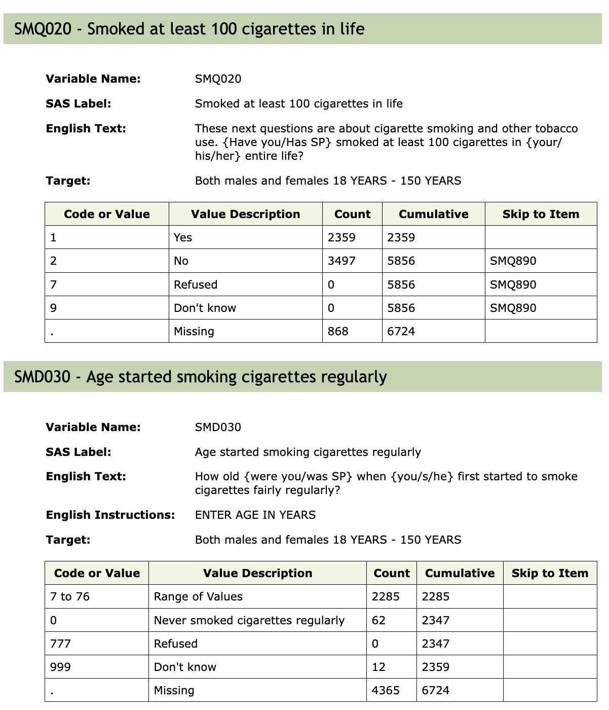

```{r, include = FALSE}
knitr::opts_chunk$set(
  collapse = TRUE,
  comment = "#>"
)
 library(phonto)
 library(DT)
 library(knitr)
```


## Introduction

  The NHANES data set provides a large diverse set of data to study health and other sociological and epidemiological topics on the US population.  In this vignette we discuss the challenges that arise due to the manner in which the survey is deployed and delivered. 
  In many situations a survey will be designed to have some form of branching logic. The logic is typically triggered off of the response to one question and designed to ensure that the next questions are relevant to the interviewee. We will use the smoking cigarettes survey, `SMQ` for cycle J (2017-2018) as the basis for our discussion since it makes rather heavy use of branching, which we will also refer to as skipping.

### The Smoking survey

```{r smq, fig.cap="Figure 1: Questions SMQ020 and SMD030", out.width="70%", echo=FALSE}

```

In Figure 1 we see the documentation for two questions in the 2017-2018 survey.  First participants were asked whether or not they had smoked 100 cigarettes in their life and those that said yes, were asked the question SMD030, at what age did they being smoking.  Anyone who responded no, to SMQ020 skipped over SMD030 and a number of other questions about smoking and cigarettes. The goal is to make the survey less onerous for those people, as there were over 20 questions skipped and someone who had never smoked would probably not have answers to those questions.


If we next consider the table for SMD030.  Of the 2359 people who answered **yes** to SMQ020 2285 gave an age, in years, 62 said that they never really smoked regularly and 12 responded that they did not know.  The 3497 people who answered **no** to SMQ020 were recorded as missing for question SMD030. There were 848 people who had missing entered for their response to SMQ020 and we see that that resulted in 4365 people as having missing values for SMD030.

Now, when we analyze this data we will need to think carefully about how to deal with the data in SMD030.  If we are analyzing smokers only, then the skipping isn't an issue. But if we want to study obesity, for example and we want to include smoking behavior as a predictor.  We will want to be careful about using SMD030. If we use it without doing anything then most modeling software, ie `lm` or `glm`, will simply remove any case (person) who has a missing value in any of their covariates. That
would be quite devestating to our analysis and would in some sense invalidate it, since in that scenario only smokers would end up in the final model.

So, if we want to keep information on smoking in our model and we want to use the age at which someone started smoking, then we need to find some way to encode SMD030 that does not use missing values.   One choice is to set the age at which they started smoking to be their current age.  Using that value one can determine the number of years they smoked by subtracting the age at which they started from their current age. For the nonsmokers this would then be 0 (zero). 

And one could entertain the use of survival analysis with that definition. For the non-smokers, we don't know if they will start in the future, we do know that they have not started by their current age. 

Our goal in this situation is to help analysts detect skipping issues and ensure that they can easily identify any skipping behavior.  How to appropriately remediate skipping is very complicated and cannot easily be automated.

## Why is this important?

Ensuring that you appropriately address skipping is going to be important for any analyses.  Failing to address this issue can lead to decreased power, since you may drop out of your analysis observations that you did not need to. Fewer individuals generally leads to less power.

It can also lead to bias.  If we return to the example above then if we do not address the missing values that were inserted into SMD030 then any analysis that includes that variable could result in all non-smokers being removed, since most modeling functions require complete cases. And so, our estimates would be applicable only to smokers, and not, as we were hoping, to the whole population.

## An example.

Here we use the function `get_skip_info` to get the skipping information for `SMQ_J`.
Each row in the returned data.frame corresponds to a question in the survey. By default `get_skip_info` returns a data.frame with one row for each question in the survey. It does not include a row for `SEQN`, so it is not quite the number of columns in the data matrix.

We assume that the questions were given in the order that they are presented in the metadata HTML page and that then allows us to identify, for each question, whether it might have been skipped, and if it was, which of the previous questions in the survey might have caused the skipping (the SkippedDueTo column).  As you will note on examining that ouput, there are some questions that might be skipped due to a fairly large number of previous questions, others that are not skipped, and some that are skipped just due to one question.

This complexity is challenging to interpret and it is likely that analysts will need to be quite careful in determining what, if anything, needs to be done in order to obtain an appropriate analysis of the data.  

```{r skipping, echo=TRUE}
gg = get_skip_info("SMQ_J")
datatable(gg)
```
